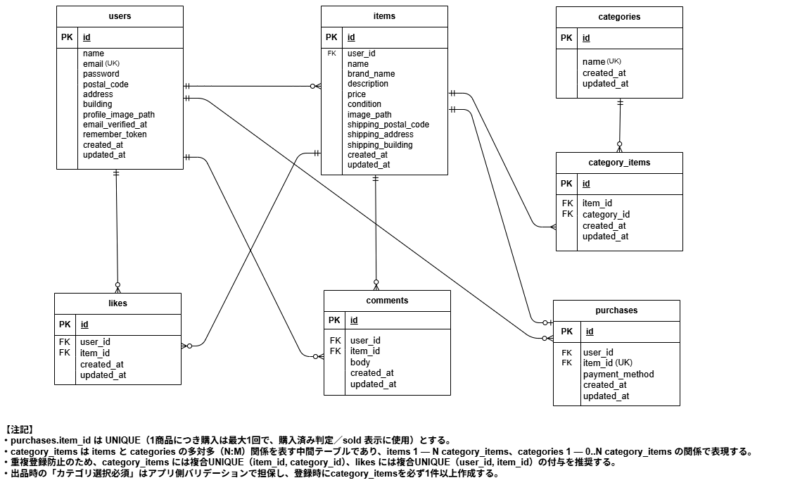

# アプリケーション名

COACHTECH 模擬案件 フリマアプリ（coachtech-furima）
アイテムの出品・購入ができるフリマアプリです。

---

## 環境構築

本アプリケーションは Docker を使用して Laravel / MySQL 環境を構築します。
以下の手順に沿ってセットアップしてください。

### Docker ビルド

- git clone https://github.com/amihira03/coachtech-furima.git
- cd coachtech-furima
- cp src/.env.example src/.env
- docker compose up -d --build

### Laravel 環境構築

- docker compose exec php bash
- composer install
- php artisan key:generate
- php artisan migrate --seed

## 初期データについて

本アプリケーションでは、商品データ・ユーザーデータはシーディングにより投入されますが、
購入データ（purchases テーブル）およびいいねデータ（likes テーブル）は初期状態では投入していません。

そのため、初期表示時にはすべての商品が未購入状態として表示されます。
また、マイリスト（/?tab=mylist）はログイン後にいいね登録を行わない限り表示されません。

※動作確認用に PurchaseTableSeeder / LikeTableSeeder を用意していますが、
提出時は DatabaseSeeder から呼び出していません。
必要に応じて `php artisan db:seed --class=PurchaseTableSeeder` 等で手動実行してください。

※ 購入済み（Sold）の商品および自分が出品した商品は、商品詳細画面・購入画面の双方で購入できないよう制御しています。

## 開発環境（URL）

- 商品一覧（トップ）：http://localhost/
- 商品一覧（マイリスト）：http://localhost/?tab=mylist
- 会員登録：http://localhost/register
- ログイン：http://localhost/login
- 商品詳細：http://localhost/item/{item_id}
- 商品購入：http://localhost/purchase/{item_id}
- 送付先住所変更：http://localhost/purchase/address/{item_id}
- 商品出品：http://localhost/sell
- マイページ：http://localhost/mypage
- プロフィール編集：http://localhost/mypage/profile
- 購入した商品一覧：http://localhost/mypage?page=buy
- 出品した商品一覧：http://localhost/mypage?page=sell
- phpMyAdmin：http://localhost:8080（※用意した場合のみ）

※ `{item_id}` は数字に置き換えてください（例：`/item/1`）

---

## 使用技術（実行環境）

- PHP：8.1（php:8.1-fpm）
- Laravel：8.75
- MySQL：8.0.26（platform: linux/amd64）
- Nginx：1.21.1
- Docker：Docker Desktop
- 認証：Laravel Fortify
- バリデーション：FormRequest
- phpMyAdmin：phpmyadmin/phpmyadmin

---

## 認証について（アクセス制御）

- 未認証でも閲覧可能
  - 商品一覧（トップ）`/`
  - 商品詳細 `/item/{item_id}`
  - 会員登録 `/register`
  - ログイン `/login`
- ログイン必須
  - 商品購入 `/purchase/{item_id}`（GET/POST）
  - 送付先住所変更 `/purchase/address/{item_id}`（GET/PATCH）
  - 商品出品 `/sell`（GET/POST）
  - マイページ `/mypage`
  - プロフィール編集 `/mypage/profile`（GET/PATCH）

※ マイリスト（`/?tab=mylist`）は、未認証の場合「何も表示されない」挙動にします。

---

## メール認証機能（応用要件）

本アプリケーションでは、Laravel Fortify を利用した
**メール認証機能（応用要件：FN012 / FN013）** を実装しています。

### メール認証の流れ

1. 会員登録後、未認証ユーザーが認証必須の操作を行うと
   **メール認証誘導画面**（`/email/verify-notice`）へ遷移します。
2. 誘導画面の「認証はこちらから」ボタンを押下すると、
   認証メールが送信され、**メール認証画面**（`/email/verify`）へ遷移します。
3. 認証メール内のリンクをクリックすると、メール認証が完了し、
   **プロフィール設定画面**（`/mypage/profile`）へ遷移します。
4. 認証メールが届かない場合は、メール認証画面から
   「認証メールを再送する」ボタンで再送信が可能です。

### メール送信について

- 開発環境では **MailHog** を使用してメールを確認します。
- 認証メールは以下の操作時に送信されます。
  - 「認証はこちらから」ボタン押下時（初回送信）
  - 「認証メールを再送する」ボタン押下時（再送）

MailHog 管理画面
http://localhost:8025

### 認証状態による制御

- メール未認証ユーザーは、認証必須画面にアクセスすると
  自動的にメール認証誘導画面へリダイレクトされます。
- 認証済みユーザーは、誘導画面・認証画面へアクセスしても
  トップページへリダイレクトされます。

---

## ダミーデータ（Seeder）

- items は「商品データ一覧」に一致する内容で投入します（画像 URL 含む）
- categories は固定データとして投入します

---

## テスト

- docker compose exec php bash
- php artisan test

---

## ER 図

